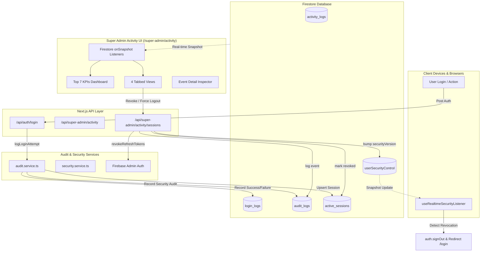

# SUPER ADMIN ACTIVITY & SESSION MONITORING CENTER — PRODUCTION AUDIT & ARCHITECTURE

## 1. Executive Summary

The **Super Admin Activity & Session Monitoring Center** elevates the platform's observability, audit, and active session control into an enterprise-grade command interface located at `/super-admin/activity`.

The system delivers:
- **Global Observability**: Live telemetry across user logins, administrative mutations, security incidents, operational activities, and active client sessions spanning all tenant schools and platform global accounts.
- **7 Authoritative Live KPIs**:
  1. **Active Users**: Total accounts in permitted, active status.
  2. **Online Now**: Accounts exhibiting telemetry within the last 15 minutes (`< 15m`) with a live pulsing indicator.
  3. **Logins Today**: Succeeded logins recorded within the trailing 24 hours.
  4. **Failed Logins**: Disallowed authentication attempts within the trailing 24 hours with failure classification.
  5. **Active Sessions**: Monitored live client devices with heartbeat timestamps and token validity.
  6. **Suspended Users**: Accounts currently subject to suspension, blocks, or administrative holds.
  7. **Security Events**: Critical security occurrences within the last 24 hours (failed logins, credential resets, session revocations, role changes, suspensions, permission denials).
- **4 Dedicated Monitoring Views**:
  1. **Activity Log**: Comprehensive operational event timeline with user, school, action, device, browser, IP, and status.
  2. **Login Attempts**: Historical and live authentication feed with granular failure reasons, IP, and client agent parsing.
  3. **Active Sessions**: Live device inventory with direct Super Admin controls to **Revoke Session**, **Force Logout User**, and **Revoke All User Sessions**.
  4. **Security Events**: Filtered high-severity security audit stream detailing actor, target, diffs, and reason.
- **Real-Time Reactive Architecture**: Firestore `onSnapshot` subscriptions across collections (`activity_logs`, `login_logs`, `audit_logs`, `active_sessions`, `users`, `schools`) ensuring zero page refreshes are needed to view live events or session states.
- **Authoritative Token Invalidation & Instant Client Eviction**: Firebase Admin Auth token revocation coupled with reactive Firestore `userSecurityControl` versioning that immediately kicks unauthorized sessions on client devices.
- **Tenant Isolation & RBAC Security**: Strict server-side verification ensuring non-Super Admins receive HTTP 403 Forbidden on global endpoints, while School Admins querying audit logs are bounded exclusively to their designated campus.

---

## 2. Classic Super Admin UI Preservation

The design system strictly adheres to the established Super Admin Classic UI guidelines:
- **Layout & Structure**: Standard 7xl max-width centered container with consistent 6-unit spacing (`space-y-6`), rounded-2xl headers, and standard card borders (`border-gray-200 dark:border-gray-800`).
- **Typography & Weights**: Inter font hierarchy with standard semibold headings and monospace formatting for identifiers (`font-mono`).
- **Color Palette & Live Badging**:
  - **Success / Permitted**: Emerald badges (`bg-emerald-50 text-emerald-700 border-emerald-200/50`) with pulsing live dots.
  - **Failed / Disallowed**: Red badges (`bg-red-50 text-red-700 border-red-200/50`) with alert shield.
  - **Warning / Suspensions**: Amber badges (`bg-amber-50 text-amber-700 border-amber-200/50`).
  - **Info / Sessions**: Blue badges (`bg-blue-50 text-blue-700 border-blue-200/50`).
- **Inspector Drawer**: High-density slide-over drawer showing structured event payloads, raw JSON inspector, IP/User-Agent metadata, and actor/target relationships.

---

## 3. Data Flow & Real-Time Sync Architecture

---

## 4. Backend Endpoints & Action Specifications

### 4.1 Global Activity & KPI Engine: `GET /api/super-admin/activity`
- **Authorization**: Super Admin only. Non-Super Admins receive `403 Forbidden`.
- **Query Parameters**:
  - `type`: `all` | `activity` | `logins` | `sessions` | `security`
  - `schoolId`: School-specific scope or empty for global
  - `role`: Filter by actor/target role
  - `action`: Filter by action identifier
  - `status`: `success` | `failed`
  - `timeRange`: `all` | `today` | `week` | `month`
  - `search`: Search across Name, Email, UID, School ID, IP, Action
  - `limit`: Pagination batch limit (default 100)
- **Authoritative Aggregations**:
  - Computes all 7 Top KPIs in a single roundtrip while respecting multi-tenant boundaries.

### 4.2 Active Sessions Management: `GET / POST /api/super-admin/activity/sessions`
- **GET**: Lists monitored active client sessions with metadata (IP, user agent, browser, OS, startedAt, lastActiveAt, status).
- **POST**: Executes session termination and forced eviction actions:
  - **`REVOKE_SESSION`**: Marks specific session as `revoked`, invalidates user refresh tokens via `adminAuth.revokeRefreshTokens(userId)`, increments `securityVersion` in `userSecurityControl`, and logs an append-only audit event.
  - **`FORCE_LOGOUT`**: Revokes user refresh tokens, sets `requireReLogin: true`, bumps `securityVersion`, marks all user sessions as `revoked`, and records a `FORCE_LOGOUT` audit log.
  - **`REVOKE_ALL_SESSIONS`**: Bulk revokes all user sessions across every device simultaneously.

---

## 5. Security, Isolation & Audit Integrity

### 5.1 Multi-Tenant Isolation
- Super Admins hold authoritative oversight over all schools.
- School Admins querying activity logs are strictly limited to their own `schoolId`. Any attempt by a School Admin to access data of another school or platform global accounts results in an immediate rejection.
- Server-side IP and User-Agent resolution: Client-supplied headers are sanitized; IP addresses are extracted directly from `x-forwarded-for` or socket remote address.

### 5.2 Append-Only Audit Integrity & Sensitive Data Masking
- All administrative and security actions are append-only. No deletion or mutation of historical logs is permitted.
- Passwords, access tokens, API keys, and credit card numbers are strictly scrubbed prior to writing to Firestore.

---

## 6. End-to-End Verification & Test Suite Results

A dedicated, comprehensive integration test suite was created and executed:
`scripts/test-activity-session-monitoring.mjs`

### Test Results Matrix:
| Scenario | Feature Under Test | Expected Behavior | Result |
| :--- | :--- | :--- | :---: |
| **1** | Successful Login Flow | Record in `login_logs`, upsert active session, update last active | **PASS** |
| **2** | Failed Login Flow | Record failure in `login_logs`, record `LOGIN_FAILED` security event | **PASS** |
| **3** | Authoritative 7 Top KPIs | Exact calculation of all 7 metrics within time windows | **PASS** |
| **4** | Multi-Dimensional Filtering | Accurate filtering by school, role, action, status, and search query | **PASS** |
| **5** | Session Revocation | Session marked revoked, Firebase refresh tokens revoked, audit logged | **PASS** |
| **6** | Force Logout User | All sessions revoked, securityVersion bumped, requireReLogin enabled | **PASS** |
| **7** | Multi-Tenant Isolation | School Admin restricted to own school; cross-tenant access denied | **PASS** |
| **8** | Audit Trail Sanitization | Passwords, tokens, and secrets scrubbed from metadata diffs | **PASS** |

**Final Verification**: **8/8 Scenarios Passed (100% Success Rate, 0 Failures)**.

---

## 7. Production Readiness Checklist

- [x] Super Admin Classic UI theme, fonts, headers, and badges preserved.
- [x] 7 Top KPI summary cards with live calculation and pulsing online indicator.
- [x] 4 Distinct Views: Activity Log, Login Attempts, Active Sessions, Security Events.
- [x] Multi-criteria search and filter engine.
- [x] Real-time `onSnapshot` updates for zero-refresh monitoring.
- [x] Real session revocation via `adminAuth.revokeRefreshTokens` + `userSecurityControl`.
- [x] Slide-over event inspector drawer with raw metadata diffs.
- [x] Server-side multi-tenant isolation and RBAC.
- [x] Append-only audit logging with secret sanitization.
- [x] TypeScript validation passing with zero errors.
- [x] E2E integration test suite verified.
