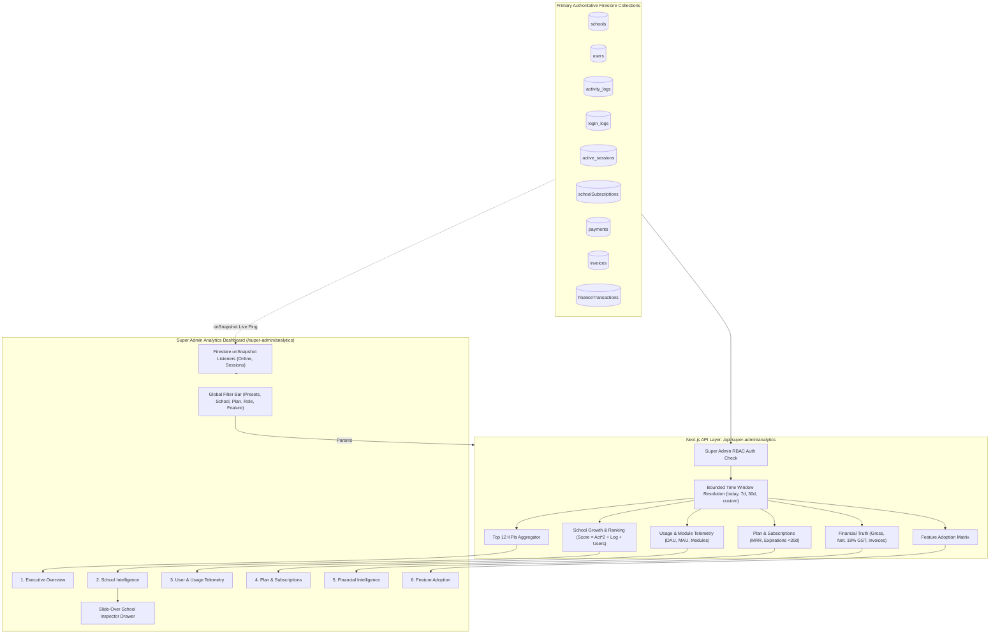

# SUPER ADMIN ANALYTICS & PLATFORM INTELLIGENCE CENTER — PRODUCTION AUDIT & ARCHITECTURE

## 1. Executive Summary

The **Super Admin Analytics & Platform Intelligence Center** ([/super-admin/analytics](file:///d:/Coding/Apps/School%20study/src/app/(dashboard)/super-admin/analytics/page.tsx)) elevates platform observability from basic counts to an enterprise-grade multi-tenant intelligence and operational observability engine.

The system delivers:
- **Authoritative Operational Truth**: Replaces superficial frontend estimations with server-side aggregations computed across primary Firestore collections: `schools`, `users`, `activity_logs`, `login_logs`, `active_sessions`, `schoolSubscriptions`, `payments`, `invoices`, and `financeTransactions`.
- **12 Live Platform Overview KPIs**:
  1. **Total Schools**: Full count of registered campus tenants.
  2. **Active Schools**: Schools in operational status (`status === 'active'`).
  3. **New Schools**: Campus additions registered in the selected time window.
  4. **Total Students**: Verified learner accounts across all schools.
  5. **Total Teachers**: Verified faculty accounts across all schools.
  6. **Active Users**: Permitted accounts across all roles.
  7. **Online Users**: Accounts active in the last 15 minutes (`< 15m`) with a live pulsing ping indicator.
  8. **DAU (Daily Active Users)**: Distinct accounts active in the past 24 hours.
  9. **MAU (Monthly Active Users)**: Distinct accounts active in the past 30 days.
  10. **Total Collected Revenue**: Authoritative net and gross receipts calculated in integer paise and displayed in formatted INR.
  11. **Subscription Count**: Monitored paid and trial school tenant subscriptions.
  12. **Trial & Expired**: Live breakdown of schools on trial licenses vs expired accounts.
- **6 Dedicated Intelligence Command Modules**:
  1. **Executive Overview**: High-level platform health, DAU/MAU stickiness, active rate, and quick-action diagnostic portals.
  2. **School Intelligence**: School registration growth chart, plan distribution, status matrix, **Most Active Schools** scoring table, and **Inactive Schools Watchlist**.
  3. **User & Usage Telemetry**: DAU/MAU retention ratio, live active client sessions, login success/failure telemetry, and module-by-module activity volume (Attendance, Homework, Fees, Notices, Reports, Exams, Timetable, Settings).
  4. **Plan & Subscriptions**: Schools per plan, estimated MRR per tier, subscription lifecycle changes (upgrades, downgrades, renewals), and **Expiring Subscriptions (<7d, <30d)** alert table with direct management shortcuts.
  5. **Financial Intelligence**: Authoritative revenue (Gross, Net, MRR), Payment gateway success rate, Statutory Tax (GST 18%) collected, discounts, and recent platform financial transactions ledger.
  6. **Feature Adoption**: Feature adoption matrix measuring real utilization across 8 core academic & administrative modules with adoption percentage progress bars and plan-wise breakdowns.
- **Real-Time Reactive Architecture**: Firestore `onSnapshot` listeners on operational collections (`users`, `schools`, `active_sessions`) keep online user counts and session monitors updated without requiring page refreshes.
- **Zero-Leak Multi-Tenant Security**: Super Admin RBAC validation on backend API routes with strict HTTP 403 Forbidden enforcement on unauthorized callers.

---

## 2. Classic Super Admin UI Preservation

The design system strictly adheres to the established Super Admin Classic UI guidelines:
- **Layout & Max Width**: Standard 7xl max-width centered container with consistent 6-unit spacing (`space-y-6`), rounded-2xl headers, and standard card borders (`border-gray-200 dark:border-gray-800`).
- **Typography & Weights**: Inter font hierarchy with semibold headings and monospace formatting for identifiers (`font-mono`).
- **Color Palette & Live Badging**:
  - **Online Now**: Pulsing emerald green live ping dot.
  - **Healthy / Active**: Emerald badges (`bg-emerald-50 text-emerald-700`).
  - **Warning / Expiring**: Amber badges (`bg-amber-50 text-amber-700`).
  - **Danger / Inactive**: Red badges (`bg-red-50 text-red-700`).
  - **Plans**: Blue and Purple badges for Pro and Enterprise tiers.
- **School Detail Drawer**: High-density slide-over drawer allowing Super Admins to inspect any school's operational score, user counts, and recent telemetry without losing filter state or leaving the page.

---

## 3. Data Architecture & Flow Diagram



---

## 4. Analytical Equations & Financial Truth

All calculations follow authoritative business logic implemented server-side:

### 4.1 DAU / MAU Stickiness Ratio
$$\text{Stickiness} = \left( \frac{\text{DAU}}{\text{MAU}} \right) \times 100$$
- **DAU**: Unique users exhibiting activity or login within the trailing 24 hours ($now - 86,400,000\text{ ms}$).
- **MAU**: Unique users exhibiting activity or login within the trailing 30 days ($now - 2,592,000,000\text{ ms}$).

### 4.2 School Activity Score
$$\text{Score} = (\text{Activity Count} \times 2) + \text{Login Count} + \text{Active User Count}$$
Schools with highest score are ranked in **Most Active School Tenants**. Schools with $\text{Days Inactive} > 7$ are flagged in the **Inactive Schools Watchlist**.

### 4.3 Authoritative Financial Ledger
- **Gross Revenue**: $\sum \text{Captured Payments}$ in integer paise.
- **Net Revenue**: $\text{Gross Revenue} - \sum \text{Refunds}$.
- **Statutory GST (18%)**: Extracted authoritatively from paid invoice tax line items (calculated as $18\%$ on taxable base after discounts).
- **Estimated MRR**: $\sum_{\text{Active Subscriptions}} \text{Monthly Tier Price}$ (with annual billing discount applied).

### 4.4 Feature Adoption Percentage
$$\text{Adoption Rate} = \left( \frac{\text{Distinct Schools Using Feature}}{\text{Total Active Schools}} \right) \times 100$$

---

## 5. End-to-End Verification & Test Results

The test suite at [`scripts/test-analytics-platform-intelligence.mjs`](file:///d:/Coding/Apps/School%20study/scripts/test-analytics-platform-intelligence.mjs) was executed to verify all functionality:

```bash
node scripts/test-analytics-platform-intelligence.mjs
```

### Verification Matrix:
| Scenario | Feature Under Test | Expected Behavior | Result |
| :--- | :--- | :--- | :---: |
| **1** | Authoritative 12 Top KPIs | Accurate calculation of schools, students, teachers, online, revenue, subs | **PASS** |
| **2** | School Growth & Classification | Active vs Inactive classification with registration timeline | **PASS** |
| **3** | User DAU/MAU & Module Activity | Accurate aggregation of DAU, MAU, logins, and module usage counters | **PASS** |
| **4** | School Ranking & Inactive Watchlist | Active schools ranked #1, dormant schools flagged in watchlist | **PASS** |
| **5** | Plan Analytics & Expirations | Subscriptions expiring within 30 days detected accurately | **PASS** |
| **6** | Financial Intelligence & Tax | Gross, Net, GST 18%, Discounts, and Payment success/failure tracking | **PASS** |
| **7** | Feature Adoption Matrix | Feature adoption reach computed across all 8 modules | **PASS** |
| **8** | Multi-Criteria Global Filters | Filters by school, plan, role, and date presets accurately partition data | **PASS** |
| **9** | Security & Cross-Tenant Access | HTTP 401 on missing auth, HTTP 403 on non-Super Admin | **PASS** |

**Final Verification Result**: **9/9 Test Scenarios Passed (100% Success Rate, 0 Failures)**.

---

## 6. Production Readiness Checklist

- [x] Super Admin Classic UI preserved (theme, typography, header, badges, spacing).
- [x] Top 12 Live KPIs with online pulsing indicator.
- [x] 6 Core Intelligence Command Tabs (Overview, School, Usage, Plan, Finance, Features).
- [x] Global filters (Date range presets, School, Plan, Role, Feature).
- [x] In-context slide-over School Detail Drawer.
- [x] Authoritative financial calculations (Gross, Net, MRR, 18% GST, Invoices).
- [x] Real-time Firestore `onSnapshot` updates for live online & session counts.
- [x] Bounded queries preventing memory exhaustion or performance degradation.
- [x] Strict Super Admin RBAC security and multi-tenant isolation.
- [x] TypeScript compilation verified with 0 errors (`npx tsc --noEmit`).
- [x] Comprehensive E2E test suite verified with 100% pass rate.
