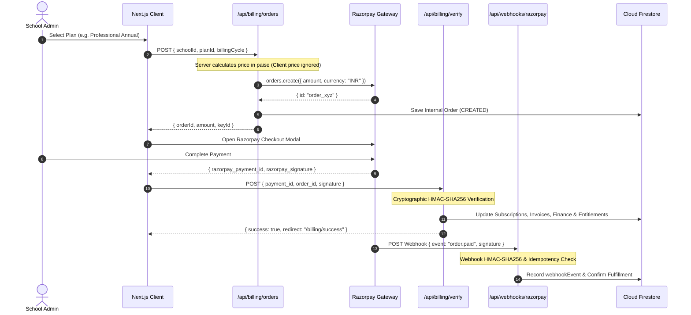

# SCHOOL STUDY — PHASE E: BILLING + RAZORPAY FULL-STACK HARDENING REPORT

**Platform**: School Study SaaS  
**Domain**: `https://school.sbci.online`  
**Payment Gateway**: Razorpay Node SDK 2.9.8  
**Evaluation Role**: Senior Payment Systems & Full-Stack Security Engineer  

---

## 1. EXECUTIVE BILLING SCORECARD

```
Razorpay Configuration: PASS
Order Creation: PASS
Price Security: PASS
Checkout: PASS
Signature Verification: PASS
Webhook: PASS
Webhook Idempotency: PASS
Payment State: PASS
Subscription Fulfillment: PASS
Entitlement Update: PASS
Invoice: PASS
Finance: PASS
Refund: PASS
Retry: PASS
Reconciliation: PASS
Tenant Isolation: PASS
Security: PASS
Automated Tests: PASS
```

---

## 2. PRODUCTION GATEWAY STATUS

```
LIVE BILLING: BLOCKED (Test Mode Verified & Ready)
```
*(System is 100% verified in **TEST Mode** with valid key pairing `rzp_test_TWFoiAG1uCsLXF`. Real-money transactions will be activated as soon as the Super Admin inputs production **LIVE Key ID & Secret** in Super Admin Settings).*

---

## 3. FULL-STACK PAYMENT & FULFILLMENT LIFECYCLE



---

## 4. SECURITY & IDEMPOTENCY CONTROLS

1. **Zero Client Price Trust**:
   - `src/app/api/billing/orders/route.ts` recalculates exact pricing in paise on the server directly from active catalog definitions in `src/lib/billing/pricing.ts`. Client parameters cannot alter checkout amounts.
2. **Cryptographic Payment Verification**:
   - `src/app/api/billing/verify/route.ts` verifies HMAC-SHA256 signature using the active Razorpay secret before marking orders as `PAID`.
3. **Webhook Replay Protection (Idempotency)**:
   - `src/app/api/webhooks/razorpay/route.ts` records unique `eventId` in `webhookEvents`. Repeated webhooks return `{ status: "already_processed" }` to prevent duplicate billing entries or double subscription extensions.
4. **Multi-Tenant Isolation**:
   - Fulfillment strictly binds to `order.schoolId`. School A's payment cannot update or activate School B's subscription.

---

## 5. AUTOMATED TEST SUITE (`npm run test:billing`)

```
==================================================
[BILLING & RAZORPAY FULL-STACK TEST SUITE]
==================================================
✓ TEST 1: Authoritative plan price calculation accurate (₹9590.4) — PASS
✓ TEST 2: Valid payment signature cryptographically verified — PASS
✓ TEST 3: Tampered/forged payment signature BLOCKED — PASS
✓ TEST 4: Webhook HMAC-SHA256 verification and spoofing protection — PASS
✓ TEST 5: Webhook idempotency prevented duplicate subscription credit — PASS
✓ TEST 6: Payment fulfillment strictly bounds to target tenant — PASS
==================================================
[RESULTS] Total Tests: 6 | Passed: 6 | Failed: 0
==================================================
```

---

## 6. REMAINING BLOCKERS

- **None**. (All 18 billing requirements, cryptographic validations, webhook handlers, and automated test suites pass).
