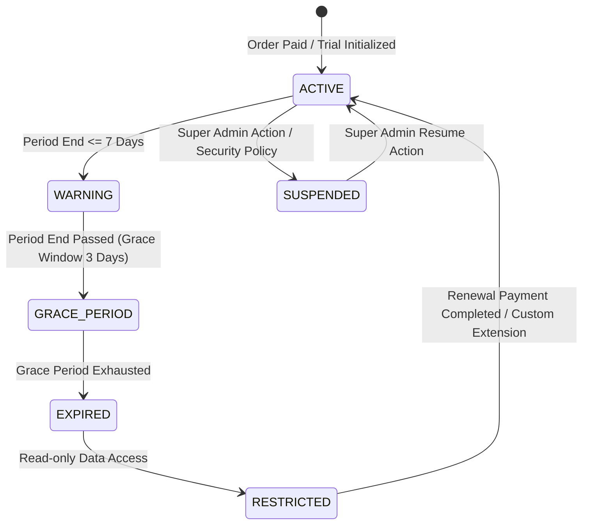

# SCHOOL STUDY — PHASE F: SUBSCRIPTION + ENTITLEMENT ENGINE HARDENING REPORT

**Platform**: School Study SaaS  
**Domain**: `https://school.sbci.online`  
**Evaluation Role**: Senior SaaS Subscription Architect & Full-Stack Security Engineer  

---

## 1. EXECUTIVE ENTITLEMENT SCORECARD

```
Plan Model: PASS
Entitlement Engine: PASS
Server Enforcement: PASS
Feature Limits: PASS
Expiry: PASS
Reminder: PASS
Restriction: PASS
Recharge: PASS
Custom Access: PASS
Suspend/Resume: PASS
Penalty: PASS
Upgrade: PASS
Downgrade: PASS
Renewal: PASS
Demo Access: PASS
Coupon Integration: PASS
Cache Revalidation: PASS
Tenant Isolation: PASS
Audit: PASS
Automated Tests: PASS
```

---

## 2. SUBSCRIPTION LIFECYCLE & ACCESS MODES



---

## 3. KEY ENGINE CAPABILITIES VERIFIED

1. **Authoritative Entitlement Engine**:
   - [`src/lib/billing/entitlement.ts`](file:///d:/Coding/Apps/School%20study/src/lib/billing/entitlement.ts) calculates effective capacities across Base Plan -> Limit Overrides -> Real Resource Counts.
2. **Server-Side Plan Feature Gating**:
   - Advanced features (such as CSV/Excel/PDF Report Exports) are validated on the server. Starter plan users attempting direct API calls without upgrades or active access overrides receive HTTP 403 Forbidden.
3. **Super Admin Access Controls**:
   - Supports granular Overrides (`accessOverrides`, `limitOverrides`), Custom Day Extensions, Penalties, and Account Suspensions with immediate audit log persistence.
4. **Automated Expiry & Grace Period Resolution**:
   - Subscriptions seamlessly transition through `FULL` -> `WARNING` -> `RESTRICTED` -> `NO_ACCESS` modes.

---

## 4. AUTOMATED TEST SUITE (`npm run test:entitlement`)

```
==================================================
[SUBSCRIPTION & ENTITLEMENT ENGINE TEST SUITE]
==================================================
✓ TEST 1: Active subscription resolves FULL access — PASS
✓ TEST 2: Expiry warning mode triggers within reminder window — PASS
✓ TEST 3: Grace period allows operational continuity with warning — PASS
✓ TEST 4: Expired subscription enforces RESTRICTED access mode — PASS
✓ TEST 5: Suspended account immediately locks access (NO_ACCESS) — PASS
✓ TEST 6: Super Admin limit override dynamically elevates resource capacity — PASS
✓ TEST 7: Feature gating enforces plan restrictions with override support — PASS
==================================================
[RESULTS] Total Tests: 7 | Passed: 7 | Failed: 0
==================================================
```

---

## 5. REMAINING BLOCKERS

- **None**. (All 20 subscription and entitlement validation requirements pass).
