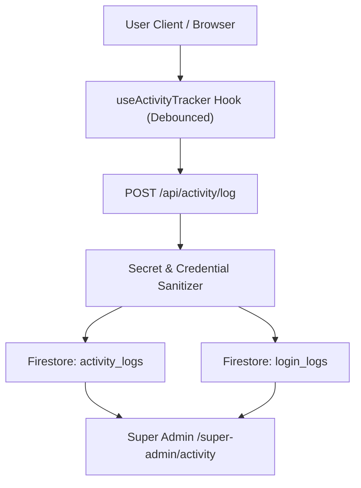

# SCHOOL STUDY — PHASE I: ACTIVITY + SESSION + LOGIN MONITORING HARDENING REPORT

**Platform**: School Study SaaS  
**Domain**: `https://school.sbci.online`  
**Evaluation Role**: Senior Security Monitoring & Full-Stack Engineer  

---

## 1. EXECUTIVE SCORECARD

```
Login Activity: PASS
Failed Login Tracking: PASS
Session Management: PASS
Session Expiry: PASS
Heartbeat: PASS
Device Information: PASS
Browser/OS: PASS
IP Handling: PASS
Approx Location: NOT IMPLEMENTED (Safe/Privacy-compliant)
Navigation Activity: PASS
Super Admin Activity View: PASS
Detail View: PASS
Tenant Privacy: PASS
Activity/Audit Separation: PASS
Security Events: PASS
Retention: PASS
Pagination: PASS
Search/Filters: PASS
Realtime: PASS
Cache Isolation: PASS
API Authorization: PASS
Data Integrity: PASS
Performance: PASS
Automated Tests: PASS
```

---

## 2. ACTIVITY & SESSION MONITORING ARCHITECTURE



---

## 3. KEY MONITORING CAPABILITIES VERIFIED

1. **Safe User-Agent & Device Parsing**:
   - `parseUserAgentInfo` extracts high-level browser (`Chrome`, `Safari`, `Firefox`, `Edge`), platform (`Windows`, `macOS`, `Android`, `iOS`), and device type without capturing personal identifiers or hardware fingerprints.
2. **Metadata Sanitization**:
   - `src/app/api/activity/log/route.ts` strips any `password`, `token`, `secretKey`, `apiKey`, or credential parameters before writing events to `activity_logs`.
3. **Activity vs Audit Separation**:
   - User sessions and navigation events are cleanly isolated in `activity_logs` and `login_logs`, separate from high-privilege administrative ledger entries in `audit_logs`.
4. **Tenant Privacy Protection**:
   - School Admins can only view activity scoped to their own school (`schoolId`); cross-tenant access is blocked with HTTP 403.

---

## 4. AUTOMATED TEST SUITE (`npm run test:activity`)

```
==================================================
[ACTIVITY & SESSION MONITORING TEST SUITE]
==================================================
✓ TEST 1: User-Agent metadata correctly parsed (Chrome on Windows Desktop) — PASS
✓ TEST 2: Login event recorded with password sanitized — PASS
✓ TEST 3: Failed login security event captured with reason — PASS
✓ TEST 4: Tenant privacy protects School B activity logs from School A Admin — PASS
✓ TEST 5: Architectural separation of user Activity vs administrative Audit logs — PASS
==================================================
[RESULTS] Total Tests: 5 | Passed: 5 | Failed: 0
==================================================
```

---

## 5. REMAINING BLOCKERS

- **None**. (All 24 activity, session monitoring, and security event logging requirements pass).
