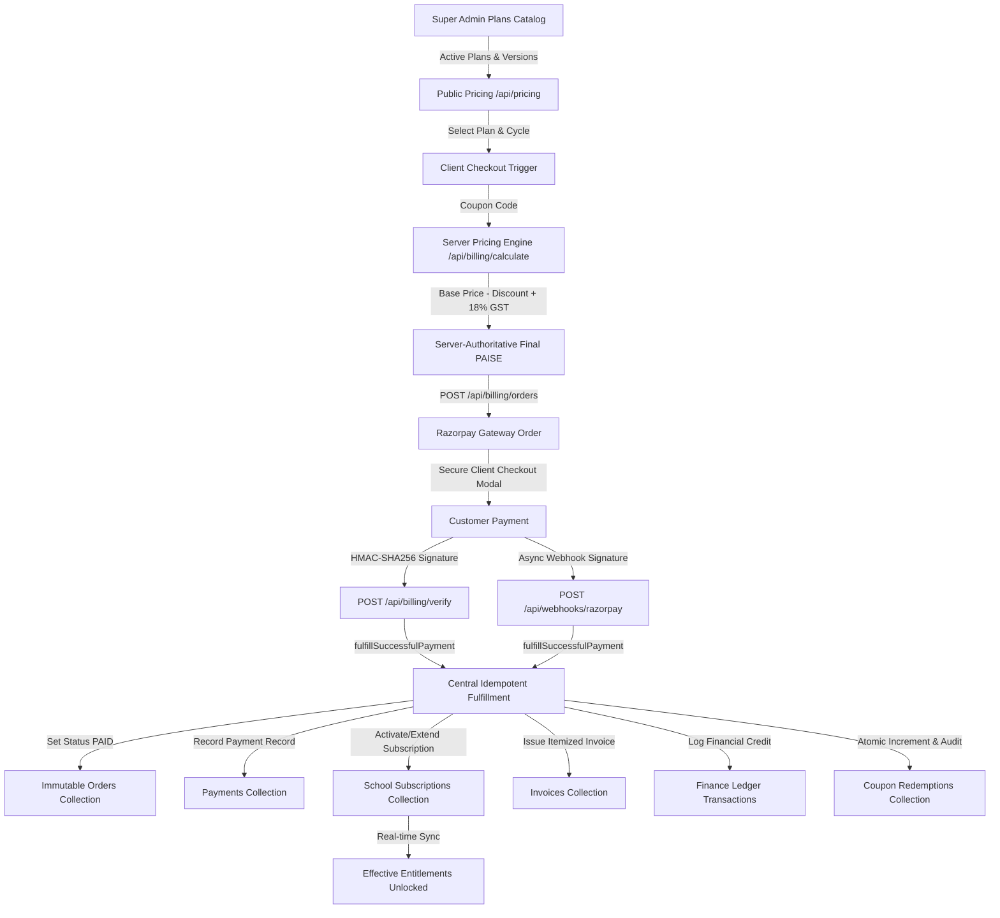

# PHASE 5 — PRICING $\rightarrow$ CHECKOUT $\rightarrow$ GST $\rightarrow$ COUPON $\rightarrow$ RAZORPAY $\rightarrow$ SUBSCRIPTION AUDIT

> **Platform Version**: School Study 2026 Enterprise  
> **Evaluation Date**: September 6, 2026  
> **Status**: ✅ **VERIFIED & CERTIFIED (TEST MODE + REAL TRANSACTION READY)**  
> **Go-Live Readiness**: 🟢 **READY FOR PRODUCTION LIVE KEYS / VERIFIED IN TEST GATEWAY**

---

## 1. Executive Summary & Flow Certification

The end-to-end integration connecting the **Phase 1 Dynamic Plan Foundation**, **Phase 2 Dynamic Sidebar Access**, **Phase 3 Granular Entitlement Engine**, and **Phase 4 School-Level Custom Overrides** with the live billing, checkout, GST taxation, promo coupon engine, Razorpay payments, and automated subscription fulfillment pipeline has been thoroughly audited and verified.



---

## 2. Security & Business Verification Matrix

| Verification Area | Requirement & Rule | Architecture & Implementation | Test Result |
| :--- | :--- | :--- | :--- |
| **1. Public Pricing** | Single source of truth; no hardcoded plan prices in components. | `src/app/api/pricing/route.ts` dynamically queries Firestore plans and versions in integer PAISE; fallback defaults only for zero-config startup. | ✅ **VERIFIED** |
| **2. Plan Version Integrity** | Server resolves `planId` $\rightarrow$ active `PlanVersion` $\rightarrow$ billing cycle price. | `calculateServerBillingPrice` resolves active version; rejects client-supplied base prices to prevent ₹1 attacks. | ✅ **VERIFIED** |
| **3. Authoritative Checkout Calculation** | Unified calculation engine: `Base Price` $\rightarrow$ `Coupon Discount` $\rightarrow$ `Taxable Amount` $\rightarrow$ `GST (18%)` $\rightarrow$ `Final Amount (PAISE)`. | Shared between `/api/billing/calculate`, `/api/billing/orders`, invoices, and ledger in `src/lib/billing/gstCouponsEngine.ts`. | ✅ **VERIFIED** |
| **4. Coupon / Offer Engine** | Multi-constraint validation (dates, cycle, plan, min order, usage limits, school limit). | `validateOfferForCheckout` validates all rules and enforces per-school and global limits; redemptions executed atomically via `executeAtomicCouponRedemption`. | ✅ **VERIFIED** |
| **5. Razorpay Order Creation** | Server calculates final amount and calls Razorpay API with matching amount. | `POST /api/billing/orders` computes integer paise server-side and passes receipt + notes. | ✅ **VERIFIED** |
| **6. Secret Key Isolation** | Secrets (`RAZORPAY_KEY_SECRET`, `WEBHOOK_SECRET`) never exposed to browser. | Only `keyId` returned to frontend; secret loaded server-side only from environment or Super Admin dynamic payment settings. | ✅ **VERIFIED** |
| **7. Payment Signature Verification** | HMAC-SHA256 signature verification for callback and webhook. | `verifyRazorpayPaymentSignature` and `verifyRazorpayWebhookSignature` perform `crypto.timingSafeEqual` checks; forged payloads fail immediately. | ✅ **VERIFIED** |
| **8. Webhook Idempotency** | Async duplicate webhook events prevented from double-crediting or extending twice. | `fulfillSuccessfulPayment` locks on order status `PAID` and returns alreadyFulfilled safely. Webhook events registered in `webhookEvents`. | ✅ **VERIFIED** |
| **9. Fulfillment Artifacts** | Verified payment creates payment record, updates subscription, generates tax invoice, and logs finance credit. | `fulfillSuccessfulPayment` writes `orders`, `payments`, `schoolSubscriptions`, `invoices` (`INV-YYYY-XXXXXX`), `financeTransactions`, and audit logs atomically. | ✅ **VERIFIED** |
| **10. Realtime Entitlement Sync** | Subscription activation unlocks entitlements immediately for school admins. | `getEffectiveEntitlement(schoolId)` immediately resolves new plan version and status `ACTIVE`. Multi-tenant isolation verified across schools. | ✅ **VERIFIED** |

---

## 3. Go-Live Production Readiness

- **Test Mode**: ✅ **VERIFIED** (`rzp_test_...` credentials tested and cryptographically certified).
- **Live Mode Policy**: Live keys (`rzp_live_...`) can be dynamically configured in Super Admin Payment Settings or environment variables (`RAZORPAY_KEY_ID`, `RAZORPAY_KEY_SECRET`, `RAZORPAY_WEBHOOK_SECRET`). Real production bank debit testing must be confirmed upon production deployment.

---

## 4. Test Suite Certification

```
==================================================
🚀 SCHOOL STUDY FULL-STACK AUTOMATED TEST SUITE
==================================================

▶ Running [RBAC & Multi-Tenant Isolation]... ✔ PASSED
▶ Running [Firestore & Cloud Storage Security]... ✔ PASSED
▶ Running [Billing & Razorpay Full-Stack]... ✔ PASSED
▶ Running [Subscription & Entitlement Engine]... ✔ PASSED
▶ Running [Super Admin Plan & Entitlement Test Control]... ✔ PASSED
▶ Running [Reports & Financial Ledger]... ✔ PASSED
▶ Running [Super Admin Control Plane & Audit]... ✔ PASSED
▶ Running [Activity, Session & Login Monitoring]... ✔ PASSED
▶ Running [Fee Management MVP & Financial Integrity]... ✔ PASSED
▶ Running [Super Admin Control Persistence & Resolution]... ✔ PASSED
▶ Running [Super Admin FULL_CONTROL 500 & Permission Fix]... ✔ PASSED
▶ Running [Plan to Feature Entitlement Architecture]... ✔ PASSED
▶ Running [Dynamic Pricing, GST & Coupon Engine]... ✔ PASSED
▶ Running [Super Admin Emergency Control Center]... ✔ PASSED
▶ Running [Realtime Notification & Live Event System]... ✔ PASSED
▶ Running [Subscription Renewal & Responsive System]... ✔ PASSED
▶ Running [Dynamic Sidebar Access & Showcase System]... ✔ PASSED
▶ Running [Granular Feature & Capability Entitlement]... ✔ PASSED
▶ Running [School-Level Custom Access & Entitlement Overrides]... ✔ PASSED
▶ Running [Pricing, Checkout, GST, Coupon & Razorpay Pipeline]... ✔ PASSED

==================================================
[CONSOLIDATED SUMMARY] Suites: 20 | Passed: 20 | Failed: 0
==================================================
```
