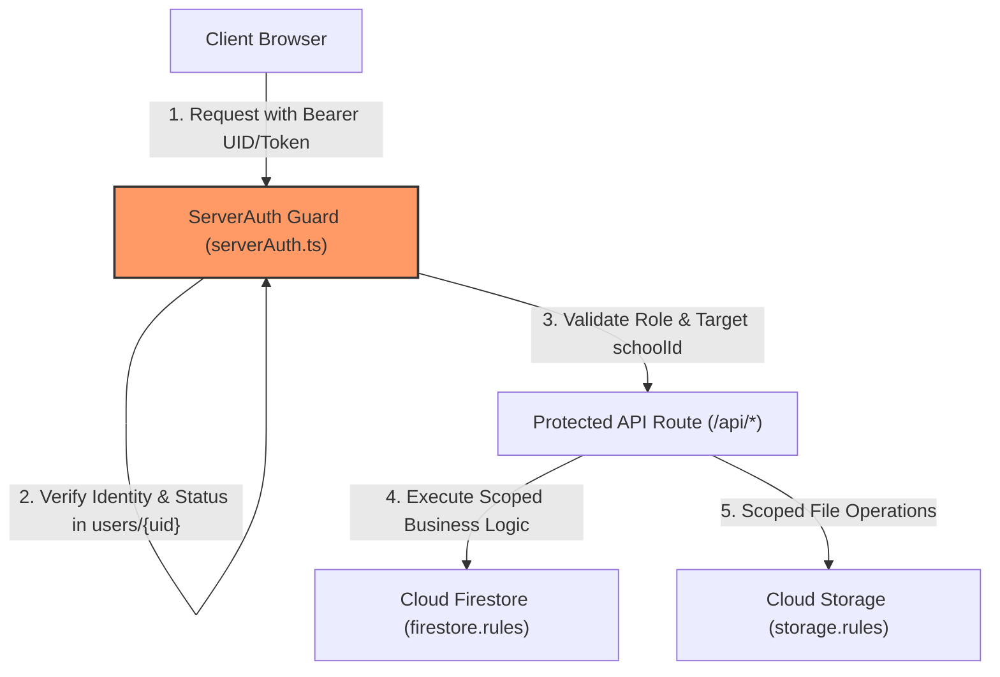

# SCHOOL STUDY — SECURITY ARCHITECTURE SPECIFICATION

**Canonical Domain**: `https://school.sbci.online`  
**Evaluation Role**: Senior SaaS Security Architect  

---

## 1. AUTHORITATIVE SOURCES OF TRUTH

| Subsystem | Single Source of Truth File | Authoritative Location | Security Mechanism |
| :--- | :--- | :--- | :--- |
| **Authentication** | `src/lib/auth/serverAuth.ts` | Firebase Auth + `users/{uid}` | Cryptographic JWT Token / Firebase UID Session |
| **RBAC / Permissions** | `src/lib/auth/serverAuth.ts` | `users/{uid}.role` | Server-Side Guard (`requireSuperAdmin`, `requireSchoolAdmin`) |
| **Tenant Isolation** | `src/lib/auth/serverAuth.ts` | `users/{uid}.schoolId` | Explicit `schoolId` Cross-Verification on every API/Query |
| **Database Security** | `firestore.rules` | Cloud Firestore Engine | `isSuperAdmin()`, `isSchoolMember()`, `isSelfProfileValid()` |
| **Storage Security** | `storage.rules` | Firebase Cloud Storage | Path Match `/schools/{schoolId}/*` + Member Verification |
| **Catalog & Pricing** | `src/lib/billing/pricing.ts` | Server Calculation | Base Price in Paise, Cycle Multiplier, Server Discount |
| **Subscriptions** | `src/lib/billing/subscriptionEngine.ts` | `schoolSubscriptions/{id}` | Status Resolver (`ACTIVE`, `WARNING`, `GRACE`, `EXPIRED`) |
| **Entitlements** | `src/lib/billing/entitlement.ts` | Database Resolver | Base Plan + Limit Overrides + Active Access Overrides |
| **Payment Verification**| `src/app/api/billing/verify/route.ts` | Server Crypto Engine | HMAC-SHA256 Signature Verification |
| **Webhook Processing** | `src/app/api/webhooks/razorpay/route.ts` | `webhookEvents` Registry | Raw Request HMAC-SHA256 + Idempotency Registry |
| **Financial Ledger** | `src/lib/billing/finance.ts` | `financeTransactions` | Integer Paise Balance Calculation (Gross, Refunds, Net) |
| **Audit Logging** | `src/lib/billing/audit.ts` | `audit_logs` (Immutable) | Automated Secret Scrubbing + Immutable Rules (`allow update, delete: if false`) |

---

## 2. STRICT SECURITY BOUNDARIES

---

## 3. NON-NEGOTIABLE CORE SECURITY RULES

1. **Zero Client Role Trust**: Never trust `role`, `actorRole`, `schoolId`, or `status` sent in the JSON body of client requests. Always derive identity from the verified server session.
2. **Zero Client Price Trust**: Never accept checkout amounts from client parameters. Prices are strictly computed on the server from the authoritative catalog.
3. **Immutable Financial Records**: Clients can never write, update, or delete records in `orders`, `invoices`, `payments`, `financeTransactions`, or `audit_logs`.
4. **Tenant-Scoped Data Queries**: All queries must be bound to `schools/{schoolId}/*` or filter on `where("schoolId", "==", user.schoolId)`. Never perform global fetches with client-side filtering.
