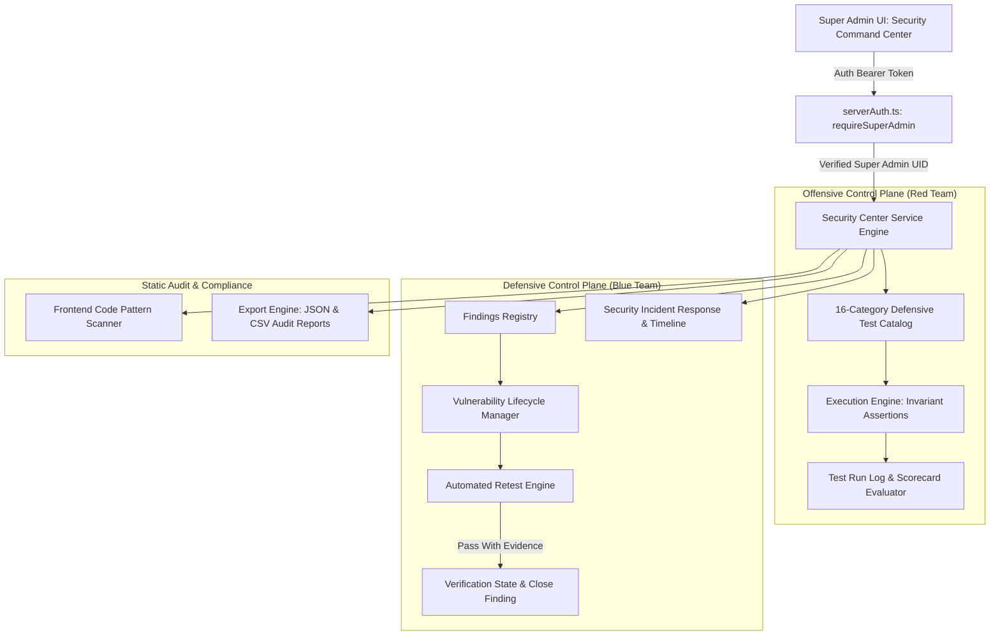

# Super Admin Security Command Center Architecture
**Platform:** School Study  
**Module:** Red Team + Blue Team Security Operations Portal  
**Target User:** Super Admin / Security Operations Leads  
**Version:** 1.0.0 (Production-Grade)

---

## 1. Executive Summary & Design Principles

The **Security Command Center** is a native, internal security governance and operations suite built into the Super Admin portal of School Study. It bridges the gap between offensive verification (Red Team automated test suites) and defensive remediation (Blue Team findings registry, retest verification, incident management, and tamper auditing).

### Non-Negotiable Safety & Defensive Boundaries
1. **Strictly Non-Destructive**: All tests execute read-only assertions, mock payloads, or defensive invariant checks. Zero malicious automation, credential theft, persistence mechanisms, or destructive mutations are executed.
2. **Authorized Scope Only**: Testing is strictly restricted to School Study's own verified domain, API routes, Firestore rules, and authenticated test identities.
3. **Server-Authoritative RBAC**: Only authenticated Super Admins with role `super_admin` confirmed in `users/{uid}` can view the dashboard or trigger test executions. Any call from student, teacher, or school admin accounts is rejected with `HTTP 403 Forbidden`.
4. **Evidence-Based Math (Zero Fake Scores)**: The platform never displays hardcoded "98% Secure" badges. The security score is derived mathematically from real test pass rates, penalized for open vulnerabilities, and credited for verified fixes. If no tests have run, it displays `NOT_VERIFIED`.

---

## 2. System Architecture



---

## 3. The 16 Security Test Categories

| Category Code | Domain | Scope & Defensive Invariant |
|---|---|---|
| `AUTH` | Authentication & Crypto | Rejection of missing/expired tokens, token forgery, invalid session cookies. |
| `RBAC` | Role Boundaries | Verification that students/teachers cannot elevate privileges or hit admin routes. |
| `TENANT` | Multi-Tenant Isolation | Proof that School A cannot read, query, or mutate School B data. |
| `API` | API Boundary Integrity | Strict rejection of malformed JSON, parameter tampering, and negative numbers. |
| `FIRESTORE` | Database Security Rules | Verification that client SDK direct writes to `audit_logs` and `plans` fail with `PERMISSION_DENIED`. |
| `STORAGE` | Cloud Storage Security | Prevention of cross-school logo/document deletion. |
| `SESSION` | Session Invalidation | Realtime session termination and token revocation upon admin force logout. |
| `ENTITLEMENT` | Feature Gating | Rejection of client-side localStorage flag tampering to unlock locked modules. |
| `BILLING` | Billing Lifecycle | Grace period enforcement and read-only lockdown on expired school plans. |
| `FINANCE` | Financial Integrity | Integer PAISE rounding, catalog pricing enforcement, and Razorpay HMAC-SHA256 signature checks. |
| `REPORTS` | Financial Reporting | Prevention of cross-tenant transaction disclosure in exports. |
| `REALTIME` | Realtime Events | Channel spoofing prevention and super-admin-only broadcast permissions. |
| `INPUT` | Input Sanitization | Protection against XSS/HTML injection in student and complaint fields. |
| `SECRETS` | Secrets Management | Verification that private keys (`FIREBASE_SERVICE_ACCOUNT`, `RAZORPAY_KEY_SECRET`) are never client-exposed. |
| `CONFIGURATION` | Config & Hardening | Suppression of debug stack traces and error dumps in production. |
| `BUSINESS_LOGIC` | Domain Rules | Prevention of student self-attendance or self-marking fee payments as paid. |

---

## 4. Strict Vulnerability Lifecycle Invariant

Finding lifecycle states follow a strict non-bypassable sequence:

```
[DISCOVERY / TEST FAIL] 
         │
         ▼
      [OPEN] ──► [TRIAGED] ──► [IN_PROGRESS] ──► [FIXED]
                                                    │
                                                    ▼
                                           [RETEST_REQUIRED]
                                                    │
                                           [AUTOMATED RETEST]
                                            /              \
                                     (FAIL)/                \(PASS)
                                          ▼                  ▼
                                    [IN_PROGRESS]       [VERIFIED]
                                                             │
                                                             ▼
                                                          [CLOSED]
```

### Invariant Enforcement Rule
A finding **cannot** transition to `CLOSED` unless its `retestStatus` is explicitly `PASSED` with captured execution evidence. Direct updates attempting `{ status: "CLOSED" }` without a passed retest are rejected with an explicit `HTTP 400: Lifecycle violation`.

---

## 5. Evidence-Based Scoring Algorithm

```
Score = clamp(0, 100, (TestPassRatio * 75) - Penalties + RemediationBonus)
```

- **Base Points (up to 75 pts)**: `(passedTests / totalTested) * 75`
- **Penalties**:
  - Open `CRITICAL`: `-25 pts` each
  - Open `HIGH`: `-15 pts` each
  - Open `MEDIUM`: `-6 pts` each
  - Open `LOW`: `-2 pts` each
  - Failed Retest: `-10 pts` each
- **Remediation Bonus**:
  - `+4 pts` per verified closed finding with documented retest pass (capped at `+25 pts`).
- **Health Classification**:
  - `NOT_VERIFIED`: If `totalTested === 0` (score is `null`).
  - `CRITICAL`: If `openCriticals > 0` OR `Score < 50`.
  - `WARNING`: If `openHighs > 0` OR `openMediums > 2` OR `Score < 70`.
  - `HEALTHY`: If 0 Criticals, 0 Highs, and `Score >= 70`.

---

## 6. API Route Contracts

All routes are protected by `requireSuperAdmin` (`src/lib/auth/serverAuth.ts`).

| Method | Endpoint | Description |
|---|---|---|
| `GET` | `/api/super-admin/security-center` | Overview scorecard, test catalog, test runs, findings, and incidents. |
| `POST` | `/api/super-admin/security-center` | Execute defensive Red Team test suite (category or ALL). |
| `GET` | `/api/super-admin/security-center/findings` | Filtered list of security findings. |
| `POST` | `/api/super-admin/security-center/findings` | Log a new security finding. |
| `PATCH`| `/api/super-admin/security-center/findings/[id]` | Update finding status (enforces lifecycle invariant). |
| `POST` | `/api/super-admin/security-center/retest` | Re-executes original defensive test, records evidence, and updates status. |
| `GET` | `/api/super-admin/security-center/incidents` | List declared incidents. |
| `POST` | `/api/super-admin/security-center/incidents` | Declare and track security incident. |
| `GET` | `/api/super-admin/security-center/reports` | Export audit reports (CSV/JSON formats). |
